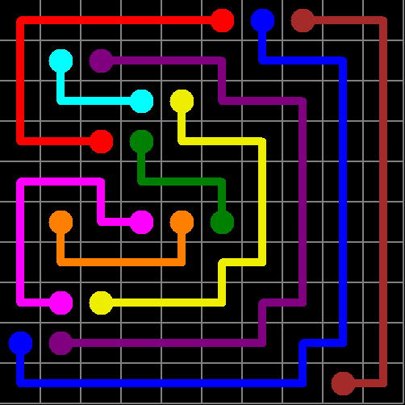

# 🎮 Free Flow Puzzle Solver

Welcome to the **Free Flow Puzzle Solver**! 🧩 This open-source C# program is designed to automatically solve Free Flow puzzles with unmatched speed and precision. Whether you're tackling the simplest grids or the most challenging puzzles, our solver has got you covered.



## 🚀 Features

- **Lightning-Fast Solving**: Solves classic Free Flow puzzles, even the hardest, in under **1ms**. ⚡
- **Automatic Puzzle Detection**: Scans and identifies grids ranging from 5x5 to 15x15.
- **Mouse Automation**: Moves the mouse to connect the dots after solving the puzzle. 🖱️
- **Optimized for Windows**: Written in C# and tailored for a seamless Windows experience.
- **Automatic Finish Scan**: Scans the board when the mouse movements are done to check if it all went well.
- **Board Printing**: Writes a bitmap image of the board at any moment.
- **Open Source**: Free to use, modify, and distribute under the MIT license.

[](https://youtu.be/zzv8Q1N16yk)


## 🛠️ Installation

1. **Clone the Repository**:
    ```bash
    git clone https://github.com/ludovicb1239/Numberlink_CS_Solver.git
    ```
2. **Open in Visual Studio**:
   - Open the `.sln` file in Visual Studio.
3. **Build the Solution**:
   - Build the solution to compile the executable.
4. **Run the Program**:
   - Execute the program and start solving puzzles in record time!

## 🧩 How It Works

1. **Puzzle Scanning**: The program scans the screen for a Free Flow puzzle, identifying the grid layout and positions of the dots.
2. **Solving the Puzzle**: The solver algorithm kicks in, using advanced techniques to find the optimal solution. The algorithm used is based on [https://github.com/thomasahle/numberlink] (A numberlink solver in go)
3. **Mouse Control**: Once solved, the program moves the mouse to connect the dots automatically.


## 🌟 Why Choose This Solver?

- **Speed**: It’s the fastest Free Flow puzzle solver on the internet.
- **Efficiency**: Solves puzzles with minimal resource usage.
- **Flexibility**: Works with various grid sizes and dot configurations.

## 🤝 Contributions

Contributions are welcome! Whether it’s fixing bugs, adding new features, or improving documentation, feel free to make a pull request.

## 📄 License

This project is licensed under the MIT License - see the [LICENSE](LICENSE) file for details.

## 👥 Contact

Have questions or feedback? Reach out via GitHub issues, or contact me at [ludovicb1239@gmail.com](mailto:ludovicb1239@gmail.com).

---

⭐ If you like this project, give it a star on GitHub! ⭐
